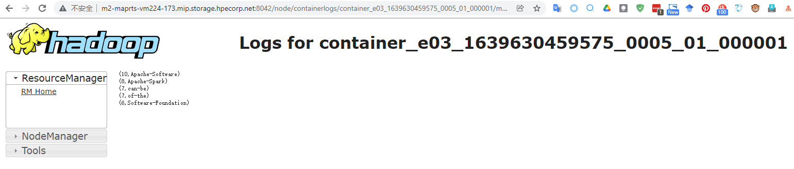

# spark-example-ezmeral-data-fabric

Notes for learning this Spark course (https://time.geekbang.org/column/intro/100090001?tab=catalog). Write and package the examples to run in Ezmeral Data Fabric (known as MapR in the past).

## What did I do in this sample project❓ (What did I record in this note)

- Use the knowledge learned about Spark development (how to use Spark's API to complete business) to write example applications.
- Some basic information about this project:

	- Development PC OS: [WSL2 on Windows 10¹🔖][Wsl2OnWindows10](recommand reading: [Set up a WSL development environment][SetUpAWslDevelopmentEnvironment]²🔖)
	- Production environment(personal): <ins>Ezmeral Data Fabric Core v6.2.0 with EEP 8.0.0</ins>
	- IDE: [Visual Studio Code][VisualStudioCode]
	- VS Code plugin: [Metals][VSCodeMetals]
	- Programming language used to write the applications: Scala

		I am a newbie to Scala and I really like this course on Udemy - "Scala Applied by Dick Wall".  
		I only finished [the 1st part][ScalaAppliedPart1].

	- Tool to build the project: [SBT][sbt-by-example.html]👈<ins>**Highly recommend to read, if you write Scala code.**</ins>
	- Source code repository used for the project: [HPE Ezmeral Data Fabric (formerly known as MapR) Maven Repositories][HpeEzmeralDataFabricMavenRepo]

- Develop applications on the local work PC and run the applications in Spark local mode.
- Build the application (packaging) and run the application on the Ezmeral Data Fabric cluster (submit the application with spark-submit).

## How to build and run the example app - "[Spark RDD Neighboring Word Count](./src/main/scala/shouneng/RddNeighboringWordCount.scala)🗄"

### TL;DR

```bash
ls -1 `pwd`
```

Sample output:

```
README.md
build.sbt
project
src
```

```bash
tree ./src
```

Sample output:

```
./src
└── main
    └── scala
        └── shouneng
            └── RddNeighboringWordCount.scala

3 directories, 1 file
```

Take a look at the core configuration file of SBT - <ins>[build.sbt](./build.sbt)</ins>🗄

```bash
sbt
```

Sample output:

```
[info] welcome to sbt 1.5.4 (Ubuntu Java 11.0.13)
[info] loading settings for project spark_rddexample-build-build-build from metals.sbt ...
[info] loading project definition from /home/raymondyan/spark_rddExample/project/project/project
[info] loading settings for project spark_rddexample-build-build from metals.sbt ...
[info] loading project definition from /home/raymondyan/spark_rddExample/project/project
[success] Generated .bloop/spark_rddexample-build-build.json
[success] Total time: 1 s, completed Jan 7, 2022, 5:19:42 PM
[info] loading settings for project spark_rddexample-build from metals.sbt,plugins.sbt ...
[info] loading project definition from /home/raymondyan/spark_rddExample/project
[success] Generated .bloop/spark_rddexample-build.json
[success] Total time: 1 s, completed Jan 7, 2022, 5:19:44 PM
[info] loading settings for project sparkRDD from build.sbt ...
[info] set current project to Spark RDD Example (in build file:/home/raymondyan/spark_rddExample/)
[info] sbt server started at local:///home/raymondyan/.sbt/1.0/server/df4dbb717ba189562adb/sock
[info] started sbt server
sbt:Spark RDD Example> 
```

```
sbt:Spark RDD Example> compile
```

Sample output:

```
[info] compiling 1 Scala source to /home/raymondyan/spark_rddExample/target/scala-2.12/classes ...
[success] Total time: 6 s, completed Jan 7, 2022, 5:24:17 PM
```

```
sbt:Spark RDD Example> package
```

Sample output:

```
[success] Total time: 0 s, completed Jan 7, 2022, 5:25:57 PM
```

```
sbt:Spark RDD Example> run
```

Sample output:

```
...
22/01/07 17:45:20 INFO TaskSetManager: Finished task 0.0 in stage 4.0 (TID 6) in 103 ms on 172.24.223.187 (executor driver) (1/1)
22/01/07 17:45:20 INFO DAGScheduler: ResultStage 4 (take at RddNeighboringWordCount.scala:52) finished in 0.133 s
22/01/07 17:45:20 INFO DAGScheduler: Job 1 is finished. Cancelling potential speculative or zombie tasks for this job
22/01/07 17:45:20 INFO TaskSchedulerImpl: Removed TaskSet 4.0, whose tasks have all completed, from pool 
22/01/07 17:45:20 INFO TaskSchedulerImpl: Killing all running tasks in stage 4: Stage finished
22/01/07 17:45:20 INFO DAGScheduler: Job 1 finished: take at RddNeighboringWordCount.scala:52, took 0.356140 s
(10,Apache-Software)
(8,Apache-Spark)
(7,can-be)
(7,of-the)
(6,Software-Foundation)
22/01/07 17:45:20 WARN FileSystem: Cleaner thread interrupted, will stop
java.lang.InterruptedException
        at java.base/java.lang.Object.wait(Native Method)
        at java.base/java.lang.ref.ReferenceQueue.remove(ReferenceQueue.java:155)
        at java.base/java.lang.ref.ReferenceQueue.remove(ReferenceQueue.java:176)
        at org.apache.hadoop.fs.FileSystem$Statistics$StatisticsDataReferenceCleaner.run(FileSystem.java:3762)
        at java.base/java.lang.Thread.run(Thread.java:829)
...
```

📔After 💡`package` command in SBT, the built application Jar file will be populated into 📁<ins>./target/scala-2.12/</ins>.

Submit the application on a Data Fabric cluster node or on an edge node:

```bash
su - mapr
export SPARK_HOME=/opt/mapr/spark/spark-3.1.2 && \
cd /home/mapr/work && \
$SPARK_HOME/bin/spark-submit \
--class shouneng.NeighboringWordCount \
--master yarn \
--deploy-mode cluster \
spark-rdd-example_2.12-0.1.0.jar
```

Check the result from DF cluster's Resource Manager UI:



[HpeEzmeralDataFabricMavenRepo]: https://docs.datafabric.hpe.com/62/DevelopmentGuide/IntegratingGitHubAndMaven.html
[Wsl2OnWindows10]: https://docs.microsoft.com/en-us/windows/wsl/install
[SetUpAWslDevelopmentEnvironment]: https://docs.microsoft.com/en-us/windows/wsl/setup/environment
[VisualStudioCode]: https://docs.microsoft.com/en-us/windows/wsl/tutorials/wsl-vscode
[VSCodeMetals]: https://scalameta.org/metals/docs/editors/vscode/
[ScalaAppliedPart1]: https://www.udemy.com/course/stairway-to-scala-applied-part-1/
[sbt-by-example.html]: https://www.scala-sbt.org/1.x/docs/sbt-by-example.html#Exit+sbt+shell
